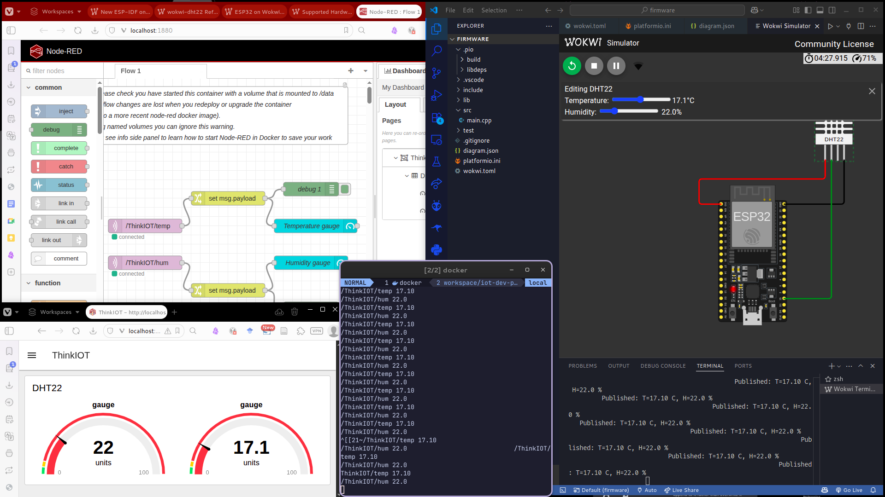

# ESP32 DHT22 → MQTT → Node-RED (Dashboard 2.0) — Wokwi + PlatformIO

End-to-end example project:
- ESP32 (simulated in Wokwi / VS Code) reads DHT22 temperature+humidity
- Publishes readings to an MQTT broker (Mosquitto in Docker)
- Node-RED subscribes and displays values on a Dashboard (FlowFuse Dashboard / Dashboard 2.0)

## Architecture

Wokwi (ESP32 sim) → MQTT publish → Mosquitto (Docker) → Node-RED (Docker) → Dashboard 2.0 gauges

## Folder structure

- `firmware/`  
  PlatformIO project + Wokwi simulation config
  - `src/main.cpp`
  - `platformio.ini` (declares library deps via `lib_deps`)
  - `wokwi.toml` + `diagram.json`

- `nodered/`  
  Project-specific Node-RED artifacts
  - exported flow JSON
  - docs + dependency list

## Prerequisites

- Docker + Docker Compose (for Mosquitto + Node-RED)
- VS Code + PlatformIO extension
- Wokwi extension for VS Code

## MQTT topics (namespaced)

- Temperature: `/thinkiot/esp32-dht22-mqtt-nodered/temp`
- Humidity:    `/thinkiot/esp32-dht22-mqtt-nodered/hum`

## Quick start

### 1) Start the shared IoT dev platform (Mosquitto + Node-RED)

This repo expects Mosquitto + Node-RED to be running (see separate repo or local folder: `~/workspace/iot-dev-platform`).

## Demo (Wokwi → MQTT → Node-RED)

This screenshot shows:
- Wokwi simulation running in VS Code (ESP32 + DHT22)
- A terminal `mosquitto_sub` subscriber printing messages from the project topics
- The Node-RED flow (MQTT-in → payload-to-number → gauges)
- The Node-RED Dashboard 2.0 page with the two gauges (temperature and humidity)
### 2) Node-RED setup

1. Install Dashboard 2.0:
   - Node-RED → Menu → Manage Palette → Install
   - Install `@flowfuse/node-red-dashboard` (NOT the deprecated `node-red-dashboard`).
2. Import the flow:
   - Node-RED → Menu → Import → select the JSON from `nodered/`
3. Deploy.

Export/import is the standard way to version Node-RED flows.  

### 3) Build firmware

Open `firmware/` in VS Code and run:
- PlatformIO: Build

PlatformIO installs dependencies declared in `lib_deps` automatically before building.

### 4) Run the simulation

VS Code → Command Palette → `Wokwi: Start Simulator`

Wokwi uses `wokwi.toml` + `diagram.json` to know what firmware to run and how the virtual hardware is connected.

### 5) Verify

MQTT monitor (optional):
`docker exec -it mosquitto mosquitto_sub -v -t "/thinkiot/esp32-dht22-mqtt-nodered/#"`

Dashboard:
`http://localhost:1880/dashboard/thinkiot`

## Troubleshooting

- If MQTT doesn’t connect from the sim:
  - ensure Mosquitto is up
  - confirm broker host in firmware is `host.wokwi.internal` and port is 1883
- If Node-RED shows no values:
  - confirm topics match exactly (case-sensitive)
  - confirm Change nodes convert payload to number before the gauges
